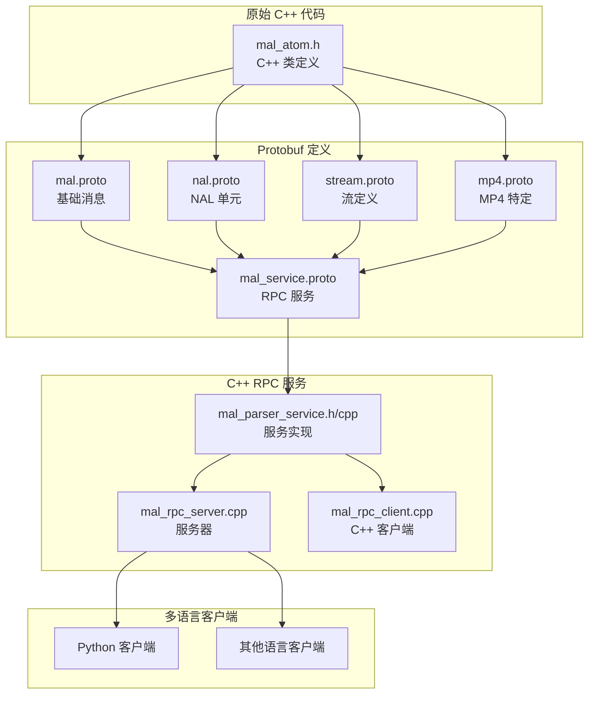

# MAL Parser Protobuf + RPC 实现指南

## 项目概述

本项目将 `src/sources/c++/parser/mal_atom.h` 中的 C++ 结构体转换为 protobuf 格式，并实现了一个完整的 gRPC 服务。这样做的好处包括：

1. **跨语言支持**: 可以从 Python、Java、Go 等多种语言调用
2. **网络透明**: 支持远程调用和分布式部署
3. **类型安全**: protobuf 提供强类型检查
4. **性能优化**: 二进制序列化，比 JSON 更高效
5. **版本兼容**: protobuf 支持向前和向后兼容

## 架构设计



## 核心转换映射

### 1. 主要类型映射

| 原始 C++ 类 | Protobuf 消息 | 说明 |
|------------|---------------|------|
| `MALFormatContext` | `MALFormatContext` | 媒体格式上下文 |
| `MALStream` | `MALStream` | 媒体流信息 |
| `MALPacket` | `MALPacket` | 媒体数据包 |
| `MALNal` | `MALNal` | NAL 单元基类 |
| `MALAVCSPS` | `MALAVCSPS` | H.264 序列参数集 |
| `MALHEVCSPS` | `MALHEVCSPS` | H.265 序列参数集 |
| `MDPAtom` | `MALAtom` | MP4 原子/盒子 |
| `MDPAtomField` | `MALAtomField` | 原子字段 |

### 2. 枚举类型映射

| C++ 枚举 | Protobuf 枚举 | 值映射 |
|---------|---------------|--------|
| `MALMediaType::none` | `MAL_MEDIA_TYPE_NONE` | 0 |
| `MALMediaType::video` | `MAL_MEDIA_TYPE_VIDEO` | 1 |
| `MALMediaType::audio` | `MAL_MEDIA_TYPE_AUDIO` | 2 |
| `MALCodecType::h264` | `MAL_CODEC_TYPE_H264` | 1 |
| `MALCodecType::h265` | `MAL_CODEC_TYPE_H265` | 2 |

### 3. 复杂结构处理

#### 继承关系
原始 C++ 代码中的继承关系通过 protobuf 的组合方式实现：

```protobuf
// C++: class MALHEVCNal : public MALNal
message MALHEVCNal {
    MALNal base = 1;  // 基类作为字段
    int32 forbidden_zero_bit = 2;
    // ... 其他字段
}
```

#### 多态处理
使用 `oneof` 处理多态：

```protobuf
message ParseNALResponse {
    oneof nal_unit {
        MALAVCSPS avc_sps = 1;
        MALAVCPPS avc_pps = 2;
        MALHEVCSPS hevc_sps = 5;
        // ... 其他类型
    }
}
```

## RPC 服务接口

### 核心服务方法

1. **ParseMediaFile**: 解析完整的媒体文件
2. **ParsePacket**: 解析单个数据包
3. **GetStreamInfo**: 获取流信息
4. **PerformShallowCheck**: 执行浅层检查
5. **PerformDeepCheck**: 执行深层检查
6. **ParseNALUnit**: 解析 NAL 单元
7. **GetVideoConfig**: 获取视频配置

### 请求/响应模式

每个 RPC 方法都遵循统一的模式：

```protobuf
message SomeRequest {
    // 请求参数
}

message SomeResponse {
    // 实际数据
    bool success = N;           // 操作是否成功
    string error_message = N+1; // 错误信息（如果失败）
}
```

## 文件结构

```
src/sources/
├── proto/                          # Protobuf 定义
│   ├── mal.proto                   # 基础消息类型
│   ├── nal.proto                   # NAL 单元消息
│   ├── stream.proto                # 流和媒体类型
│   ├── mp4.proto                   # MP4 特定消息
│   ├── mal_service.proto           # RPC 服务定义
│   └── gen_proto.sh               # 生成脚本
├── c++/
│   ├── parser/
│   │   └── mal_atom.h             # 原始 C++ 定义
│   ├── proto_gen/                 # 生成的 protobuf 文件
│   └── rpc/                       # RPC 服务实现
│       ├── mal_parser_service.h   # 服务接口
│       ├── mal_parser_service.cpp # 服务实现
│       ├── mal_rpc_server.cpp     # 服务器主程序
│       ├── mal_rpc_client.cpp     # C++ 客户端
│       ├── CMakeLists.txt         # 构建配置
│       ├── build.sh               # 构建脚本
│       └── README.md              # 详细文档
└── python/                        # Python 客户端
    ├── mal_rpc_client.py          # Python 客户端实现
    ├── generate_proto.py          # Python protobuf 生成
    └── requirements.txt           # Python 依赖
```

## 快速开始

### 1. 构建 C++ RPC 服务

```bash
cd src/sources/c++/rpc
./build.sh
```

### 2. 启动服务器

```bash
cd src/sources/c++/rpc/build
./mal_rpc_server
```

### 3. 使用 C++ 客户端

```bash
./mal_rpc_client parse /path/to/video.mp4
./mal_rpc_client check /path/to/video.mp4
```

### 4. 使用 Python 客户端

```bash
# 安装依赖
pip install -r src/sources/python/requirements.txt

# 生成 Python protobuf 文件
cd src/sources/python
./generate_proto.py

# 使用客户端
./mal_rpc_client.py parse /path/to/video.mp4
./mal_rpc_client.py check /path/to/video.mp4
```

## 优势与特性

### 1. 跨语言互操作性
- C++ 服务器可以被任何支持 gRPC 的语言调用
- 统一的接口定义，避免语言绑定问题

### 2. 网络透明性
- 本地调用和远程调用使用相同的接口
- 支持负载均衡和服务发现

### 3. 类型安全
- 编译时类型检查
- 自动生成的序列化/反序列化代码

### 4. 性能优化
- 二进制协议，比 JSON 更高效
- 支持流式传输大文件

### 5. 版本兼容性
- 向前兼容：新版本可以处理旧版本的消息
- 向后兼容：旧版本可以忽略新字段

## 扩展指南

### 添加新的消息类型

1. 在相应的 `.proto` 文件中定义新消息
2. 重新生成 protobuf 文件
3. 在服务实现中添加转换逻辑

### 添加新的 RPC 方法

1. 在 `mal_service.proto` 中定义新方法
2. 在 `mal_parser_service.h` 中声明
3. 在 `mal_parser_service.cpp` 中实现
4. 更新客户端代码

### 支持新的编程语言

1. 使用对应语言的 protobuf 编译器生成代码
2. 实现客户端逻辑
3. 参考 Python 客户端的实现模式

## 性能考虑

### 1. 内存管理
- 使用智能指针管理 C++ 对象生命周期
- 避免不必要的数据拷贝

### 2. 并发处理
- gRPC 服务器默认支持多线程
- 可以配置线程池大小

### 3. 流式处理
- 对于大文件，考虑使用流式 RPC
- 分块传输避免内存溢出

### 4. 缓存策略
- 缓存解析结果避免重复计算
- 使用 LRU 缓存管理内存

## 故障排除

### 常见问题

1. **protobuf 版本不兼容**
   - 确保客户端和服务器使用兼容的 protobuf 版本

2. **gRPC 连接失败**
   - 检查网络连接和防火墙设置
   - 验证服务器地址和端口

3. **序列化错误**
   - 检查消息字段是否正确设置
   - 验证数据类型匹配

### 调试技巧

1. 启用 gRPC 详细日志：
   ```bash
   export GRPC_VERBOSITY=DEBUG
   export GRPC_TRACE=all
   ```

2. 使用 gRPC 工具调试：
   ```bash
   grpc_cli call localhost:50051 mal.MALParserService.ParseMediaFile "file_path: '/path/to/file'"
   ```

## 总结

通过将 `mal_atom.h` 的结构转换为 protobuf 并实现 RPC 服务，我们实现了：

1. **现代化的 API**: 从单体 C++ 库转换为微服务架构
2. **跨语言支持**: 支持多种编程语言的客户端
3. **网络化部署**: 支持分布式和云原生部署
4. **类型安全**: 强类型接口定义和自动代码生成
5. **高性能**: 二进制协议和高效的序列化

这个实现为媒体分析库提供了现代化的服务接口，便于集成到各种应用和系统中。